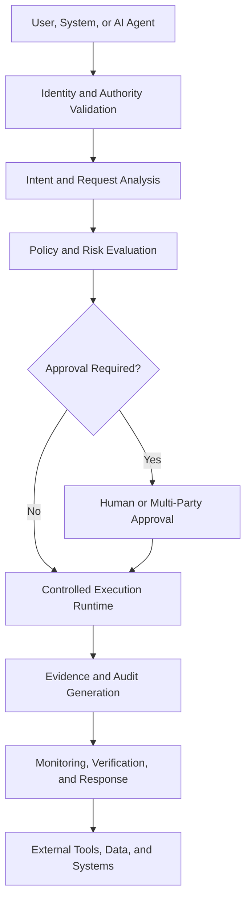

# AegisLayer Architecture

> AI-native security, governance, and runtime protection for autonomous and agentic systems.

AegisLayer is a public reference architecture and research initiative developed by **VND TECH LLC**. It focuses on a central principle:

**AI capability must remain separate from execution authority.**

An AI system may be able to propose an action, but real-world execution should require independent checks for identity, authority, policy, risk, approval, runtime constraints, evidence, and monitoring.

## Explore the Documentation

-   :material-eye-outline:{ .lg .middle } **Vision**

    ---

    Understand the long-term direction, core principles, and intended audience.

    [:octicons-arrow-right-24: Read the vision](VISION.md)

-   :material-sitemap-outline:{ .lg .middle } **Architecture**

    ---

    Review the high-level control layers, trust boundaries, and request lifecycle.

    [:octicons-arrow-right-24: Explore the architecture](ARCHITECTURE.md)

-   :material-shield-alert-outline:{ .lg .middle } **Threat Model**

    ---

    Examine AI-specific threats, abuse cases, protected assets, and control families.

    [:octicons-arrow-right-24: Review the threat model](THREAT_MODEL.md)

-   :material-scale-balance:{ .lg .middle } **Governance**

    ---

    Learn how authority, approval, accountability, exceptions, and evidence fit together.

    [:octicons-arrow-right-24: Read the governance model](GOVERNANCE.md)

-   :material-help-circle-outline:{ .lg .middle } **FAQ**

    ---

    Get concise answers to common questions about AegisLayer and its public scope.

    [:octicons-arrow-right-24: Open the FAQ](FAQ.md)

-   :material-book-alphabet:{ .lg .middle } **Glossary**

    ---

    Use the shared terminology for architecture, security, governance, and execution.

    [:octicons-arrow-right-24: Browse the glossary](GLOSSARY.md)

## Conceptual Control Flow

## Core Principles

- **Security by design** — security controls belong in the architecture from the beginning.
- **Governance by default** — actions should operate within explicit authority and policy boundaries.
- **Evidence before trust** — consequential decisions and actions should be reviewable and attributable.
- **Least privilege** — users, agents, tools, and services should receive only the authority required.
- **Human accountability** — people remain responsible for consequential approvals, exceptions, and response.
- **Defense in depth** — no single model, filter, or control should be treated as sufficient.
- **Fail-closed execution** — uncertainty about identity, authority, policy, or state should stop or escalate execution.

## Public Scope

This site contains public architecture, threat-model, governance, research, and educational material.

It does not intentionally disclose:

- Credentials or secrets
- Customer information
- Confidential infrastructure
- Proprietary implementation details
- Security-sensitive deployment configurations
- Unapproved patent-sensitive material

## Current Status

AegisLayer is under active research and development. The documentation describes architectural goals, design principles, and public research directions. It does not claim that every described capability is currently deployed, independently certified, or sufficient to prevent every cyberattack.

## Project Links

- [GitHub Repository](https://github.com/vsdatta/aegislayer-architecture)
- [AegisLayer Website](https://aegislayer.ai)
- [Security Policy](../SECURITY.md)
- [Contributing Guide](../CONTRIBUTING.md)
- [Roadmap](../ROADMAP.md)

Copyright © VND TECH LLC.
